# kobe_project

[](https://kedro.org)

# 1. Configuração Inicial do Projeto

## 1.1 Clonar o projeto

``` bash
git clone <URL_DO_REPOSITORIO>
```
## 1.2 Criar o ambiente virtual .venv 

### 1.2.1 Instalar python 3.11 (utilizado 3.11.9)

Verificar se a versão 3.11 está instalada

Linux

``` bash
ls /usr/bin/python*
```

Windows

``` bash
py --list 
``` 

Caso não tenha a versão instalada:

Windows

https://www.python.org/downloads/release/python-3119/

Linux

``` bash
sudo apt-get install python3.11
```

### 1.1.2 Criar o ambiente virtual com o python 3.11

Linux
``` bash
python3.11 -m venv .venv
```

Windows

``` bash
py 3.11 -m venv .venv
```

### 1.1.3 Inicializar o ambiente virtual

linux

Ativar o ambiente virtual, estando na raiz do projeto

``` bash
source .venv/bin/activate
``` 

windows

Ativar o ambiente virtual, estando na raiz do projeto

``` bash
.\.venv\Scripts\activate
``` 

## 1.3 Instalar as bibliotecas

Instalar o pip-tools

``` bash
pip install pip-tools
``` 

Executar o comando:

``` bash
pip-compile
```

Executar o comando:

``` bash
pip-sync
``` 

# 2. Executar o projeto

## 2.1 Criar o arquivo de configuração entre o Kedro e o Mlflow
``` bash
kedro mlflow init
``` 

caso o arquivo mlflow.yml ja exista na pasta conf/local, será respondido com o erro e o arquivo não será criado novamente. 

Foi utilizado a criação default, caso ja a tenha não será necessário apagar o arquivo para criar um novo. Continue para o próximo passo

## 2.2 Inicializar o IPython Kernel para ser encontrado pelo notebook do VSCode

``` bash
kedro jupyter setup
``` 

## 2.3 Iniciar a UI do Mlflow

``` bash
mflow ui
```

Abrir o link informado para visualizar a interface do Mlflow

o que me foi apresentado, conforme configuração default: http://127.0.0.1:5000

## 2.4 Executar os pipelines

abrir um novo terminal

``` bash
kedro run
``` 

Aguarde a execução dos pipelines, demorou em torno de 7 minutos

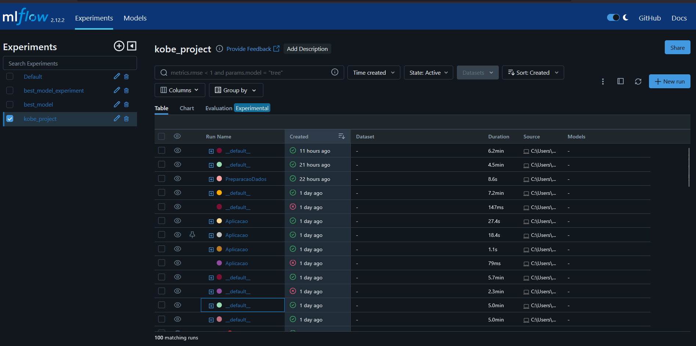


## 2.5 Servir o modelo

Verificar em "Models" da UI do Mlflows (http://127.0.0.1:5000/#/models), qual é a versão do modelo.

Executar o comando abaixo em um novo terminal, informando o numero da versão observada no UI do Mlflow

``` bash
mlflow models serve -m models:/model_prod/<numero_da_versão> --no-conda -p 1234
``` 

exemplo:

``` bash
mlflow models serve -m models:/model_prod/1 --no-conda -p 1234
``` 

o Modelo estará sendo servido no caminho apresentado no terminal, que no meu caso, retornou:

http://127.0.0.1:1234/

O modelo está sendo servido via requisições http no endpoint


http://127.0.0.1:1234/invocations

## 2.6 Inicializando o Streamlit

Execute em um novo terminal:

``` bash
streamlit run dashboard_monitoring.py
```

Clique no caminho retornado no terminal para ver a UI do Streamlit, no meu caso, retornou:

http://192.168.0.156:8501

## 2.7 Projeto inicializado

### 2.7.1 Mlflow
Para interação com o Mlflow, acesse o link obtido da interface do Mlflow para ver o Experiment kobe_project que foi executado, bem como o modelo registrado

### 2.7.2 Streamlit
Para interação com o Monitoramento do modelo, acesse o link obtido ao executar o comando do Streamlit e veja como o modelo treinado com os dados de treino e de testes se saiu com os dados de produção.

Para realizar a predição manual de valores das features, clicar na aba "Predição manual"

# 3. Resolução da questões

1. A solução criada nesse projeto deve ser disponibilizada em repositório git e disponibilizada em servidor de repositórios (Github (recomendado), Bitbucket ou Gitlab). O projeto deve obedecer o Framework TDSP da Microsoft (estrutura de arquivos, arquivo requirements.txt e arquivo README - com as respostas pedidas nesse projeto, além de outras informações pertinentes). Todos os artefatos produzidos deverão conter informações referentes a esse projeto (não serão aceitos documentos vazios ou fora de contexto). Escreva o link para seu repositório. 

R:

2. Iremos desenvolver um preditor de arremessos usando duas abordagens (regressão e classificação) para prever se o "Black Mamba" (apelido de Kobe) acertou ou errou a cesta.
Baixe os dados de desenvolvimento e produção aqui (datasets: dataset_kobe_dev.parquet e dataset_kobe_prod.parquet). Salve-os numa pasta /data/raw na raiz do seu repositório.
Para começar o desenvolvimento, desenhe um diagrama que demonstra todas as etapas necessárias para esse projeto, desde a aquisição de dados, passando pela criação dos modelos, indo até a operação do modelo.

R:

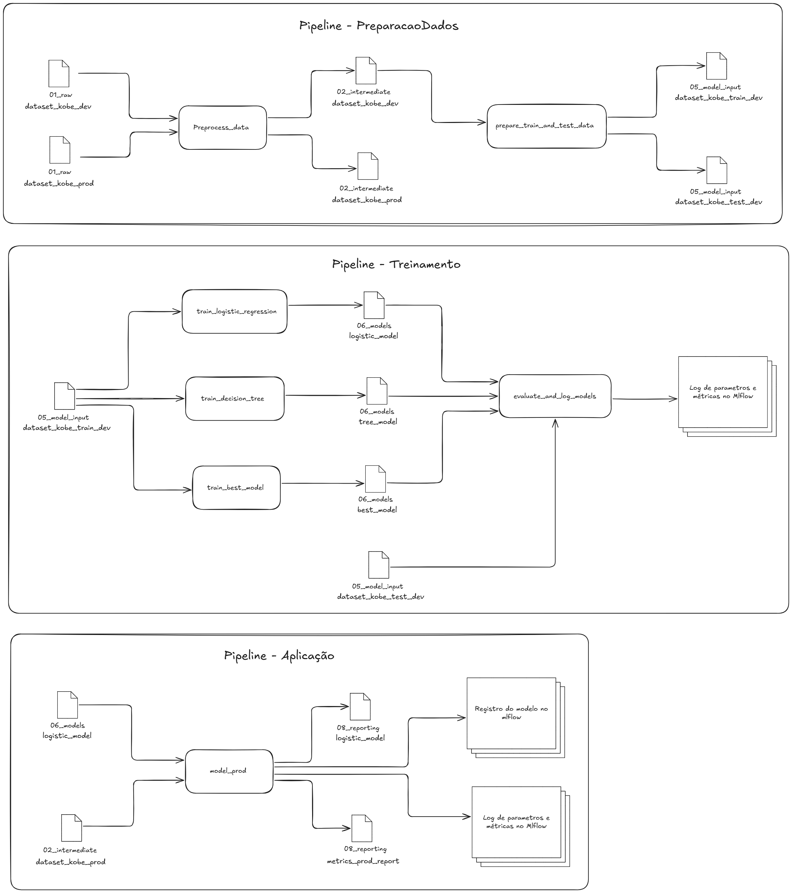

3. Como as ferramentas Streamlit, MLFlow, PyCaret e Scikit-Learn auxiliam na construção dos pipelines descritos anteriormente? A resposta deve abranger os seguintes aspectos:
- a. Rastreamento de experimentos;
- b. Funções de treinamento;
- c. Monitoramento da saúde do modelo;
- d. Atualização de modelo;
- e. Provisionamento (Deployment).

R:

As ferramentas Streamlit, MLflow, PyCaret e Scikit-Learn foram fundamentais para a construção e operacionalização dos pipelines apresentados. Cada uma delas contribuiu com funcionalidades específicas ao longo do ciclo de vida do modelo de machine learning.

No aspecto de rastreamento de experimentos, o MLflow foi utilizado para registrar os parâmetros utilizados nos treinamentos (como o número de iterações, métrica de otimização e ID de sessão), além das métricas obtidas (como accuracy, f1_score, log_loss e roc_auc). Também foi usado para armazenar artefatos como modelos .pkl e relatórios .parquet, permitindo comparar experimentos diretamente pela interface do MLflow.

As funções de treinamento foram construídas com o uso do PyCaret, que abstrai e automatiza muitas das etapas comuns do Scikit-Learn, como encoding de variáveis, validação cruzada, tuning de hiperparâmetros e seleção automática do melhor modelo com compare_models(). Internamente, o PyCaret utiliza estimadores do Scikit-Learn e de outras bibliotecas de machine learning.

Para o monitoramento da saúde do modelo, foi desenvolvido um dashboard interativo em Streamlit. Ele permite visualizar métricas de desempenho com dados de produção, como acurácia, F1-score e log loss, além de exibir a matriz de confusão e a distribuição das probabilidades previstas. Essa interface facilita a detecção de desvios de comportamento do modelo, como queda de performance ou mudança no padrão dos dados. Além disso, foi adicionada uma aba de predição manual, que permite ao usuário inserir valores personalizados das features e obter a predição correspondente, proporcionando uma análise mais detalhada e interativa do comportamento do modelo.

A atualização de modelo pode ser realizada com facilidade, pois os pipelines são modulares. Dados de produção podem ser usados como nova base de treino, e as funções de treinamento podem ser reexecutadas para gerar um novo modelo. O MLflow permite registrar esse novo modelo, mantendo um controle de versões.

Por fim, no que diz respeito ao provisionamento, o modelo final é servido por meio do MLflow usando o endpoint REST /invocations. O Streamlit se conecta a esse endpoint para enviar dados e obter predições em tempo real. Isso possibilita o uso do modelo tanto via interface quanto via API, promovendo integração com aplicações reais.

Em conjunto, essas ferramentas tornam o processo completo — da experimentação à operação — eficiente, rastreável e pronto para produção.

4. Com base no diagrama realizado na questão 2, aponte os artefatos que serão criados ao longo de um projeto. Para cada artefato, a descrição detalhada de sua composição.

R:

## 01_raw

### dataset_kobe_dev.parquet 

```
<class 'pandas.core.frame.DataFrame'>
Index: 24271 entries, 0 to 30696
Data columns (total 25 columns):
 #   Column              Non-Null Count  Dtype  
---  ------              --------------  -----  
 0   action_type         24271 non-null  object 
 1   combined_shot_type  24271 non-null  object 
 2   game_event_id       24271 non-null  int64  
 3   game_id             24271 non-null  int64  
 4   lat                 24271 non-null  float64
 5   loc_x               24271 non-null  int64  
 6   loc_y               24271 non-null  int64  
 7   lon                 24271 non-null  float64
 8   minutes_remaining   24271 non-null  int64  
 9   period              24271 non-null  int64  
 10  playoffs            24271 non-null  int64  
 11  season              24271 non-null  object 
 12  seconds_remaining   24271 non-null  int64  
 13  shot_distance       24271 non-null  int64  
 14  shot_made_flag      20285 non-null  float64
 15  shot_type           24271 non-null  object 
 16  shot_zone_area      24271 non-null  object 
 17  shot_zone_basic     24271 non-null  object 
 18  shot_zone_range     24271 non-null  object 
 19  team_id             24271 non-null  int64  
 20  team_name           24271 non-null  object 
 21  game_date           24271 non-null  object 
 22  matchup             24271 non-null  object 
 23  opponent            24271 non-null  object 
 24  shot_id             24271 non-null  int64  
dtypes: float64(3), int64(11), object(11)
memory usage: 4.8+ MB
```

### dataset_kobe_prod.parquet

```
<class 'pandas.core.frame.DataFrame'>
Index: 6426 entries, 10 to 30695
Data columns (total 25 columns):
 #   Column              Non-Null Count  Dtype  
---  ------              --------------  -----  
 0   action_type         6426 non-null   object 
 1   combined_shot_type  6426 non-null   object 
 2   game_event_id       6426 non-null   int64  
 3   game_id             6426 non-null   int64  
 4   lat                 6426 non-null   float64
 5   loc_x               6426 non-null   int64  
 6   loc_y               6426 non-null   int64  
 7   lon                 6426 non-null   float64
 8   minutes_remaining   6426 non-null   int64  
 9   period              6426 non-null   int64  
 10  playoffs            6426 non-null   int64  
 11  season              6426 non-null   object 
 12  seconds_remaining   6426 non-null   int64  
 13  shot_distance       6426 non-null   int64  
 14  shot_made_flag      5412 non-null   float64
 15  shot_type           6426 non-null   object 
 16  shot_zone_area      6426 non-null   object 
 17  shot_zone_basic     6426 non-null   object 
 18  shot_zone_range     6426 non-null   object 
 19  team_id             6426 non-null   int64  
 20  team_name           6426 non-null   object 
 21  game_date           6426 non-null   object 
 22  matchup             6426 non-null   object 
 23  opponent            6426 non-null   object 
 24  shot_id             6426 non-null   int64  
dtypes: float64(3), int64(11), object(11)
memory usage: 1.3+ MB
```

## 02_intermediate

### dataset_kobe_dev.parquet

```
<class 'pandas.core.frame.DataFrame'>
Index: 20285 entries, 1 to 30696
Data columns (total 7 columns):
 #   Column             Non-Null Count  Dtype  
---  ------             --------------  -----  
 0   lat                20285 non-null  float64
 1   lon                20285 non-null  float64
 2   minutes_remaining  20285 non-null  int64  
 3   period             20285 non-null  int64  
 4   playoffs           20285 non-null  int64  
 5   shot_distance      20285 non-null  int64  
 6   shot_made_flag     20285 non-null  int32  
dtypes: float64(2), int32(1), int64(4)
memory usage: 1.2 MB
```

### dataset_kobe_prod.parquet

```
<class 'pandas.core.frame.DataFrame'>
Index: 5412 entries, 10 to 30695
Data columns (total 7 columns):
 #   Column             Non-Null Count  Dtype  
---  ------             --------------  -----  
 0   lat                5412 non-null   float64
 1   lon                5412 non-null   float64
 2   minutes_remaining  5412 non-null   int64  
 3   period             5412 non-null   int64  
 4   playoffs           5412 non-null   int64  
 5   shot_distance      5412 non-null   int64  
 6   shot_made_flag     5412 non-null   int32  
dtypes: float64(2), int32(1), int64(4)
```

## 05_model_input

### dataset_kobe_test_dev.parquet

```
<class 'pandas.core.frame.DataFrame'>
Index: 4057 entries, 11048 to 25721
Data columns (total 7 columns):
 #   Column             Non-Null Count  Dtype  
---  ------             --------------  -----  
 0   lat                4057 non-null   float32
 1   lon                4057 non-null   float32
 2   minutes_remaining  4057 non-null   int8   
 3   period             4057 non-null   int8   
 4   playoffs           4057 non-null   int8   
 5   shot_distance      4057 non-null   int8   
 6   shot_made_flag     4057 non-null   int8   
dtypes: float32(2), int8(5)
memory usage: 83.2 KB
```

### dataset_kobe_train_dev.parquet

```
<class 'pandas.core.frame.DataFrame'>
Index: 16228 entries, 3066 to 18911
Data columns (total 7 columns):
 #   Column             Non-Null Count  Dtype  
---  ------             --------------  -----  
 0   lat                16228 non-null  float32
 1   lon                16228 non-null  float32
 2   minutes_remaining  16228 non-null  int8   
 3   period             16228 non-null  int8   
 4   playoffs           16228 non-null  int8   
 5   shot_distance      16228 non-null  int8   
 6   shot_made_flag     16228 non-null  int8   
dtypes: float32(2), int8(5)
memory usage: 332.8 KB
```

## 06_models

### best_model

Modelo de treinado com os dados do 05_input_model - dataset_kobe_train_dev.parquet, com a função compare_models do pycaret, trazendo o modelo que saiu melhor no treinamento

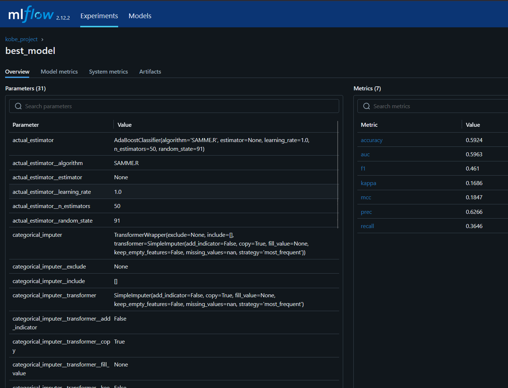

### logistic_model

Modelo de regressão logistica treinado com os dados do 05_input_model - dataset_kobe_train_dev.parquet

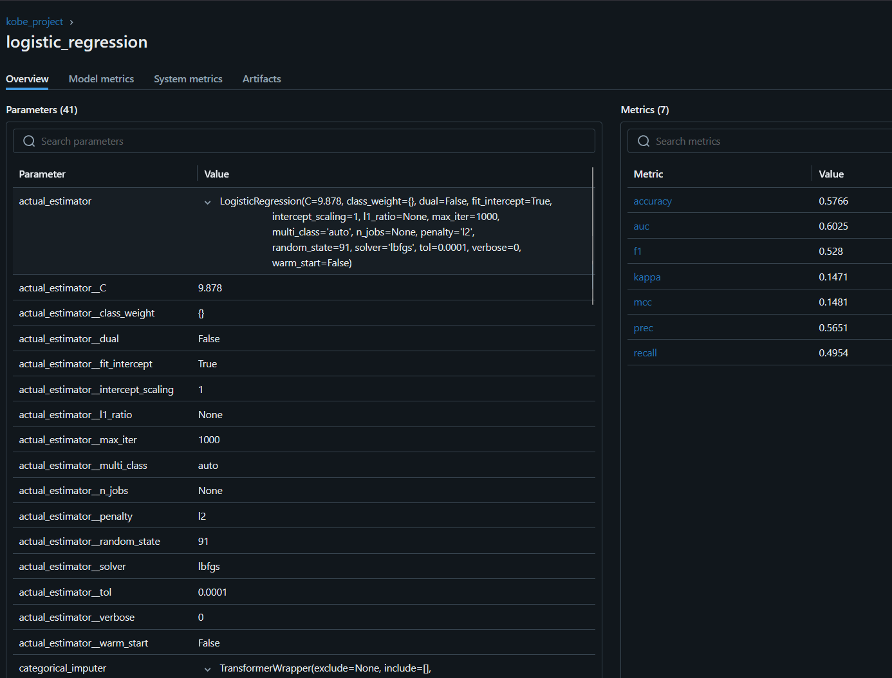

### tree_model

Modelo de arvore de decisão treinado com os dados do 05_input_model - dataset_kobe_train_dev.parquet

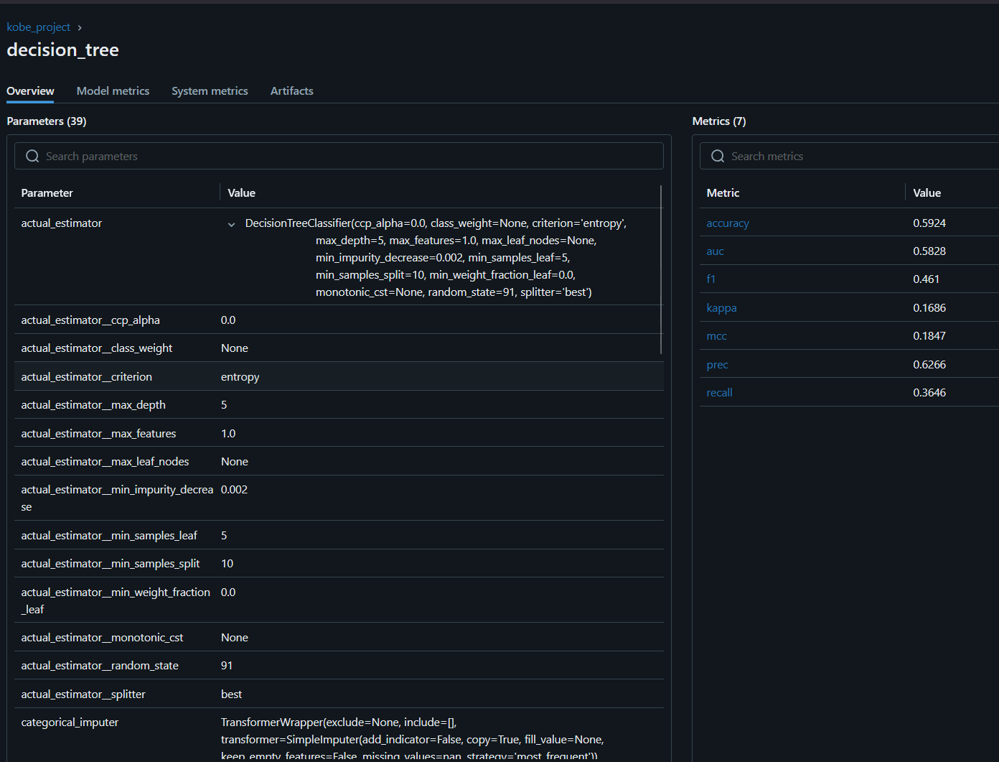


## 08_reporting

### metric_prod_report

``` 
<class 'pandas.core.frame.DataFrame'>
Index: 5412 entries, 10 to 30695
Data columns (total 10 columns):
 #   Column              Non-Null Count  Dtype  
---  ------              --------------  -----  
 0   lat                 5412 non-null   float32
 1   lon                 5412 non-null   float32
 2   minutes_remaining   5412 non-null   int8   
 3   period              5412 non-null   int8   
 4   playoffs            5412 non-null   int8   
 5   shot_distance       5412 non-null   int8   
 6   shot_made_flag      5412 non-null   int8   
 7   prediction_label    5412 non-null   int32  
 8   prediction_score_0  5412 non-null   float64
 9   prediction_score_1  5412 non-null   float64
dtypes: float32(2), float64(2), int32(1), int8(5)
memory usage: 216.7 KB
```

### production_model

Foi escolhido o modelo de regressão logistica para realizar a predição dos dados de produção 02_intermediate - dataset_kobe_prod.parquet.

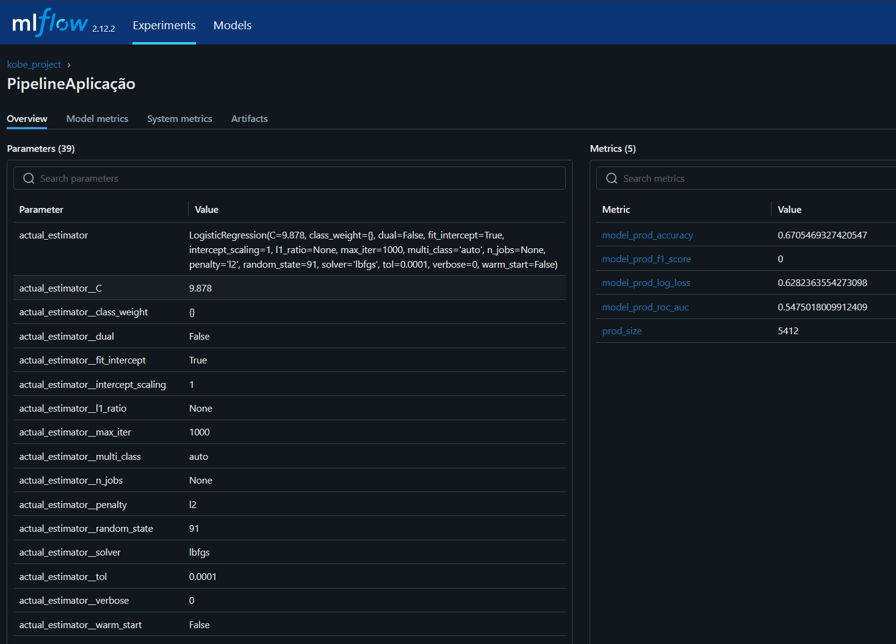

5. Implemente o pipeline de processamento de dados com o mlflow, rodada (run) com o nome "PreparacaoDados":
Os dados devem estar localizados em "/data/raw/dataset_kobe_dev.parquet" e "/data/raw/dataset_kobe_prod.parquet" 
Observe que há dados faltantes na base de dados! As linhas que possuem dados faltantes devem ser desconsideradas. Para esse exercício serão apenas consideradas as colunas: 
- i. lat
- ii. lng
- iii. minutes remaining
- iv. period
- v. playoffs
- vi. shot_distance

    A variável shot_made_flag será seu alvo, onde 0 indica que Kobe errou e 1 que a cesta foi realizada. O dataset resultante será armazenado na pasta "/data/processed/data_filtered.parquet". Ainda sobre essa seleção, qual a dimensão resultante do dataset?

    vii. Separe os dados em treino (80%) e teste (20 %) usando uma escolha aleatória e estratificada. Armazene os datasets resultantes em "/Data/processed/base_{train|test}.parquet . Explique como a escolha de treino e teste afetam o resultado do modelo final. Quais estratégias ajudam a minimizar os efeitos de viés de dados.

    viii. Registre os parâmetros (% teste) e métricas (tamanho de cada base) no MlFlow

R:

## vii.

A separação dos dados em treino (80%) e teste (20%), utilizando uma divisão aleatória e estratificada, é uma etapa fundamental no processo de desenvolvimento de modelos de machine learning. A estratificação garante que a proporção das classes da variável "target" seja mantida nos conjuntos de dados, o que evita distorções e permite uma avaliação mais confiável da performance do modelo.

Os dados de teste precisam ser representativos, pois o modelo pode parecer muito bom durante a validação, mas apresentar desempenho insatisfatório em produção. Da mesma forma, se os dados de treino forem muito limitados ou enviesados, o modelo pode aprender padrões incorretos, sofrendo de underfitting ou overfitting.

Para minimizar os efeitos de viés de dados, podemos utilizar de algumas estratégias:

- Estratificação, como foi utilizada, para preservar a distribuição da variável alvo;

- Validação cruzada (cross-validation), que permite avaliar o modelo em diferentes subconjuntos de dados e obter métricas mais estáveis;

- Análise exploratória e detecção de outliers, que ajuda a identificar padrões anômalos ou dados mal distribuídos;

- Balanceamento das classes, quando há desbalanceamento significativo.

- Atualização periódica do modelo, para evitar que ele se torne obsoleto frente a mudanças no comportamento dos dados em produção (data drift).

Essas práticas tornam o processo de modelagem mais robusto e confiável, aumentando a capacidade de generalização do modelo em novos dados.

# viii.

Registro no Mlflow do parâmetro de porcentagem de teste e das métricas de tamanho do dataset de treino e do dataset de teste.

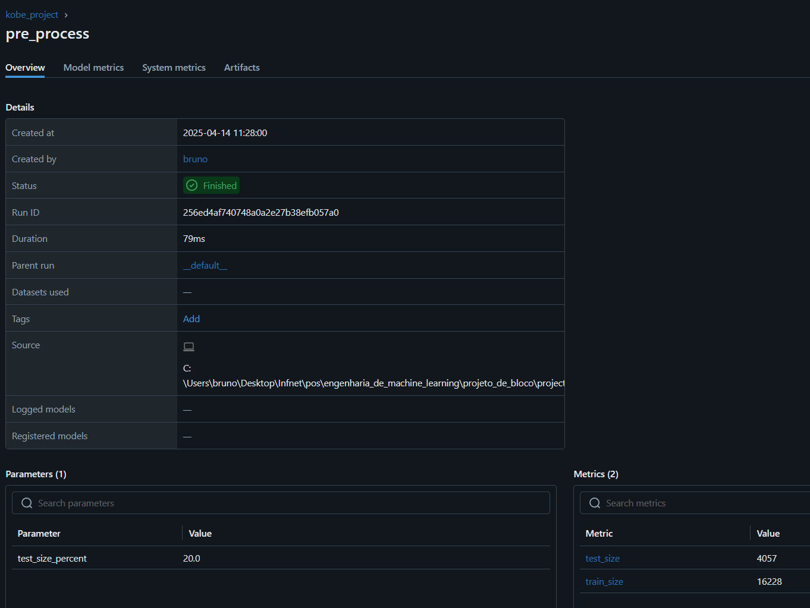

6. Implementar o pipeline de treinamento do modelo com o MlFlow usando o nome "Treinamento"
- a. Com os dados separados para treinamento, treine um modelo com regressão logística do sklearn usando a biblioteca pyCaret.
- b. Registre a função custo "log loss" usando a base de teste
- c. Com os dados separados para treinamento, treine um modelo de árvore de decisão do sklearn usando a biblioteca pyCaret.
- d. Registre a função custo "log loss" e F1_score para o modelo de árvore.
- e. Selecione um dos dois modelos para finalização e justifique sua escolha.

R:

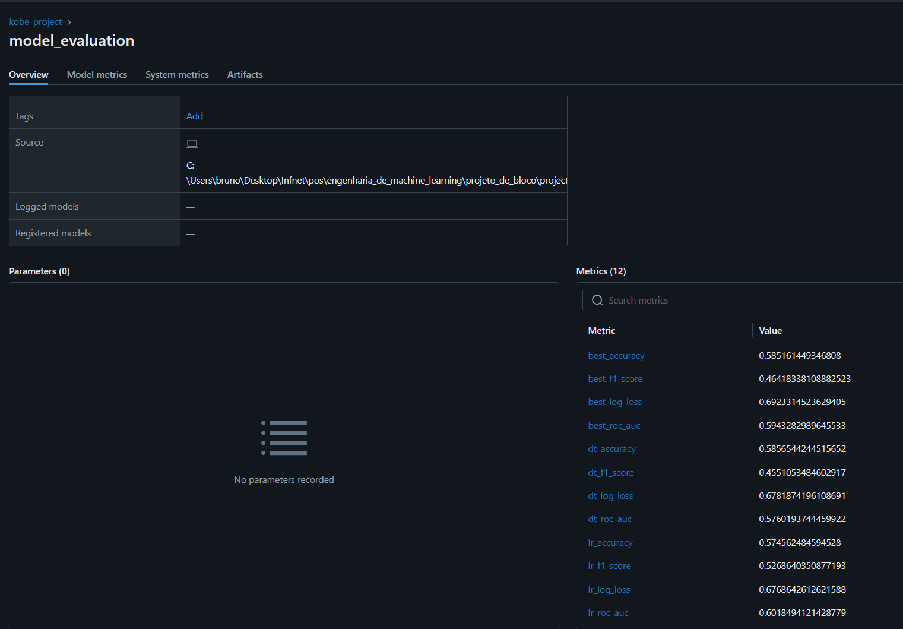

| Modelo                   | Log Loss   | F1 Score |
|--------------------------|------------|----------|
| Best Model               | 0.6923     | 0.4642   |
| Decision Tree (DT)       | 0.6782     | 0.4551   |
| Logistic Regression (LR) | 0.6769     | 0.5269   |

### Interpretação por métrica:

F1 Score: melhor é o Logistic Regression

Log Loss: menor é melhor → Logistic Regression

O modelo de regressão logistica se mostrou melhor nas duas métricas escolhidas, sendo que apesar de não ser uma grande diferença no Log Loss, no F1 Score a regressão logística foi melhor por um valor mais considerável.

O log loss é um métrica ue mede o quão longe as probabilidades previstão estão dos valores reais, quanto menor o log loss indica que as probabilidades estão mais calibradas.

O F1 Score é uma métrica que equilibra a precisão e o recall, um valor mais alto de f1 indica que o modelo tem um melhor desempenho na detecção da classe positiva.

Dessa forma, foi o modelo de regressão logistica foi escolhido para finalização.

7. Registre o modelo de classificação e o sirva através do MLFlow (ou como uma API local, ou embarcando o modelo na aplicação). Desenvolva um pipeline de aplicação (aplicacao.py) para carregar a base de produção (/data/raw/dataset_kobe_prod.parquet) e aplicar o modelo. Nomeie a rodada (run) do mlflow como “PipelineAplicacao” e publique, tanto uma tabela com os resultados obtidos (artefato como .parquet), quanto log as métricas do novo log loss e f1_score do modelo.
- a. O modelo é aderente a essa nova base? O que mudou entre uma base e outra? Justifique.
- b. Descreva como podemos monitorar a saúde do modelo no cenário com e sem a disponibilidade da variável resposta para o modelo em operação.
- c. Descreva as estratégias reativa e preditiva de retreinamento para o modelo em operação.

R: 

## a.

Não, o modelo não é aderente a base de produção 02_intermediate - dataset_kobe_prod.parquet

O modelo teve um resultado de 0 para F1 Score, indicando que não acertou nenhum Verdadeiro Positivo, conforme mostrado na matriz de confusão e na distribuição dos scores da classe positiva (nenhum valor passou de 0.5 para ser considerado verdadeiro)

### Mlflow

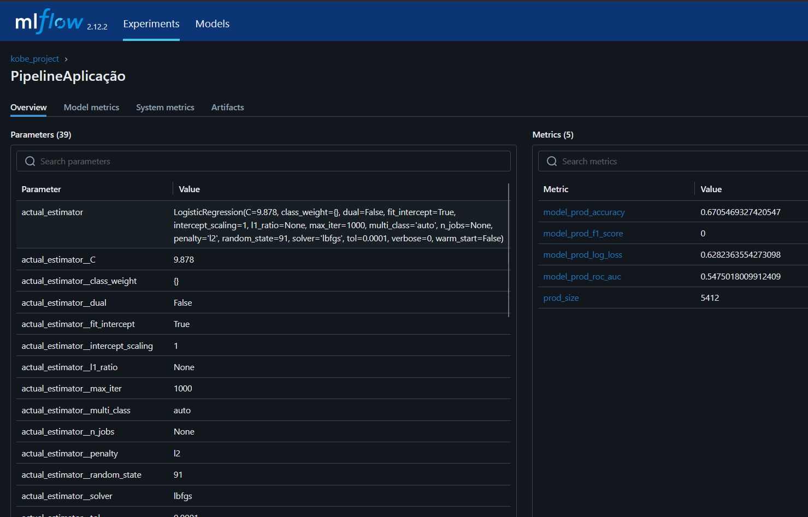

### Streamlit

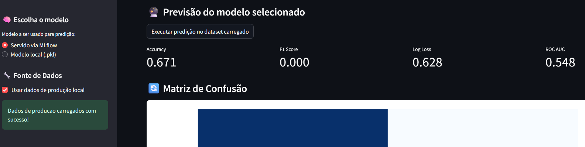


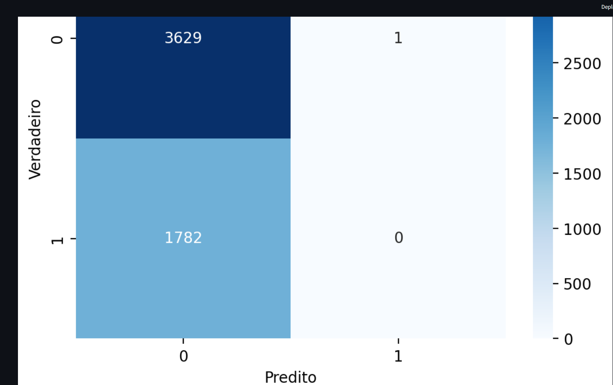


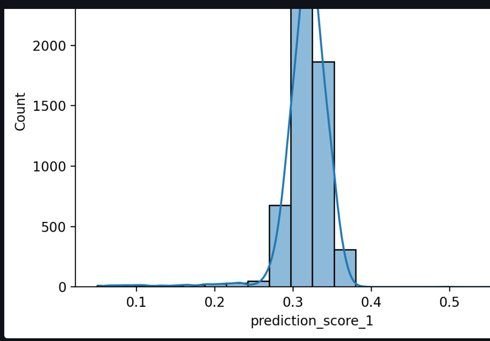


8. Implemente um dashboard de monitoramento da operação usando Streamlit.

### Model monitoring

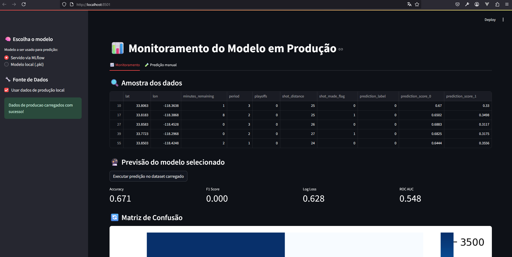

[Streamlit model monitoring](data/08_reporting/Monitoramento_do_modelo.pdf)

### Manual prediction

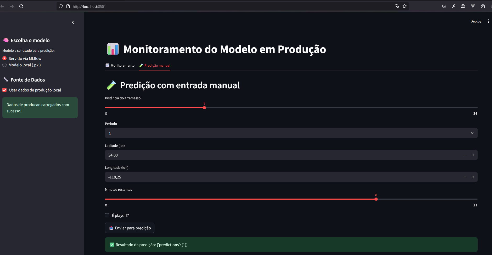


[Streamlit model monitoring - manual prediction](data/08_reporting/monitoramento_do_modelo_predicao_manual.pdf)


